# Tennis Court Booking App

SetPoint is a full-stack Django web application that allows users to book tennis courts online. The platform includes user authentication, real-time court availability, booking management, and Stripe payment integration.


## Repository Links

- GitHub Repository: [Repo](https://github.com/steff657/Hackathon-Project-2)
- Live Site: [SetPoint](https://set-point-a25bf5f77a69.herokuapp.com/)
- Project Board: [Project Board](https://github.com/users/steff657/projects/8)

## Table Of Contents:

1. [Repository Links](#repository-links)
2. [Contributors](#contributors)
3. [Overview](#overview)
4. [Key Features](#key-features)
5. [Design & Planning](#design--planning)

- [User Stories](#user-stories)
- [Wireframes](#wireframes)
- [Agile Methodology](#agile-methodology)
- [Typography](#typography)
- [Colour Scheme](#colour-scheme)
- [Database Diagram](#database-diagram)

6. [Features](#features)

- [Navigation](#navigation)
- [Footer](#footer)
- [Home-page](#home-page)
- [Add your pages](#add-your-pages)
- [CRUD](#crud)
- [Authentication-Authorisation](#authentication-authorisation)

7. [Technologies Used](#technologies-used)
8. [Libraries Used](#libraries-used)
9. [Testing](#testing)
10. [Bugs](#bugs)
11. [Deployment](#deployment)
12. [AI](#ai)
13. [Credits](#credits)

## Contributors

- Steffan - https://github.com/steff657
- Hamza - https://github.com/hamza-m1
- Hannah - https://github.com/hannahashe
- Leila - https://github.com/leilacsak

## Overview

SetPoint is a Django-based tennis court booking platform built for a team hackathon.
Users can discover available courts, book time slots, pay securely, and manage their bookings from a personal dashboard.

The app supports the full booking lifecycle:

- browse courts by date and surface
- create and edit bookings
- complete payment through Stripe Checkout
- cancel bookings
- save favourite court/date/time slots for quick rebooking
- contact support for refund-related requests

## Key Features

- **Court availability view** with date and surface filtering
- **Booking flow** with conflict prevention and maintenance-window checks
- **My Bookings dashboard** with upcoming/past sections and booking actions
- **Payment tracking** (`pending`, `paid`, `cancelled`, `refunded`)
- **Saved/Bookmarked slots** with one-click rebook links
- **Support contact form** linked to optional booking context
- **Admin tools** for booking management and refund handling

## Design & Planning:

### User Stories

For detailed User Stories, including acceptance criteria and task breakdowns, please see the [SetPoint Project Board](https://github.com/users/steff657/projects/8)

**Story Titles:**

- Player wants to create an account so that they can book courts and manage reservations.
- Player wants secure login so that bookings are protected.
- Player wants to filter courts by surface type so that choose their preference.
- Player wants see peak/off-peak pricing so that they understand the benefits & differences between the price points.
- Player wants to edit their own bookings so that to change the date/time without cancellation and re-booking.
- Player wants to view court availability so that they can choose a suitable slot.
- Player wants reminder notifications so that they remember the booking.
- Player wants to book a court so that they can reserve a time to play.
- Player wants to pay for bookings so that reservation can be confirmed conveniently.
- Player wants booking confirmation so that they know their reservation is secure.
- Admin wants to issue refunds for cancellations so that customers are treated fairly and refunded with minimal hassle.
- Player wants to cancel a booking so that they can free up the slot.
- Admin wants to view all bookings so that they can manage court usage efficiently.
- Admin wants to manage court availability so that they can open/close courts for maintenance/events.
- Player wants to view their past bookings so that they can easily rebook frequent times/courts.
- Visitor wants an About page so that they can trust and understand the organisation.
- Player wants to save courts or timeslots so that they can easily and quickly book favourite days/times/courts.
- Player wants find partners so that they can play with someone of similar level.

### Wireframes

The following wireframes were created for desktop and mobile views:

#### Home Page

- Desktop:

  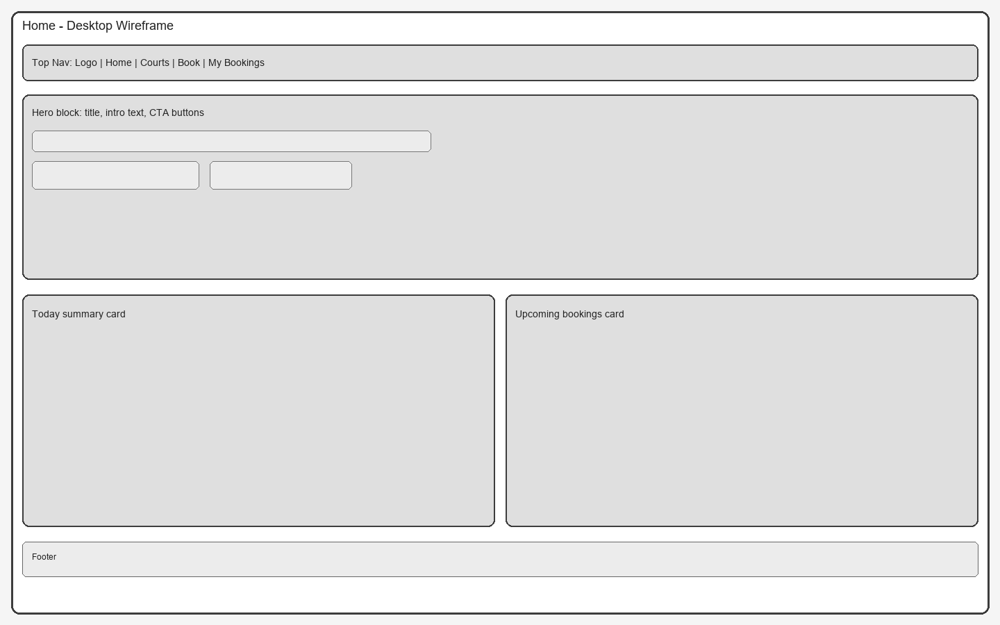
- Mobile:

  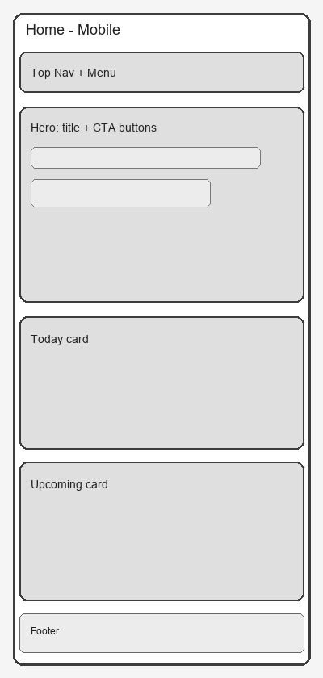

#### Courts Page

- Desktop:

  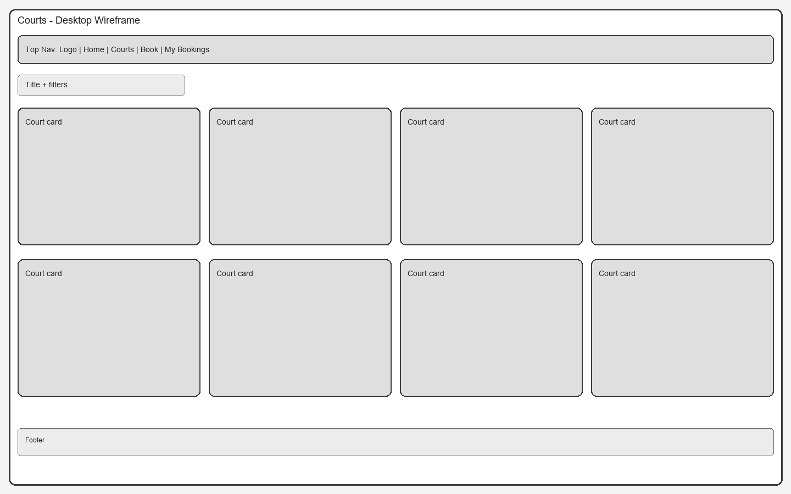
- Mobile:

  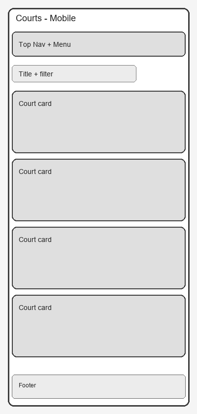

#### Book Court Page

- Desktop:

  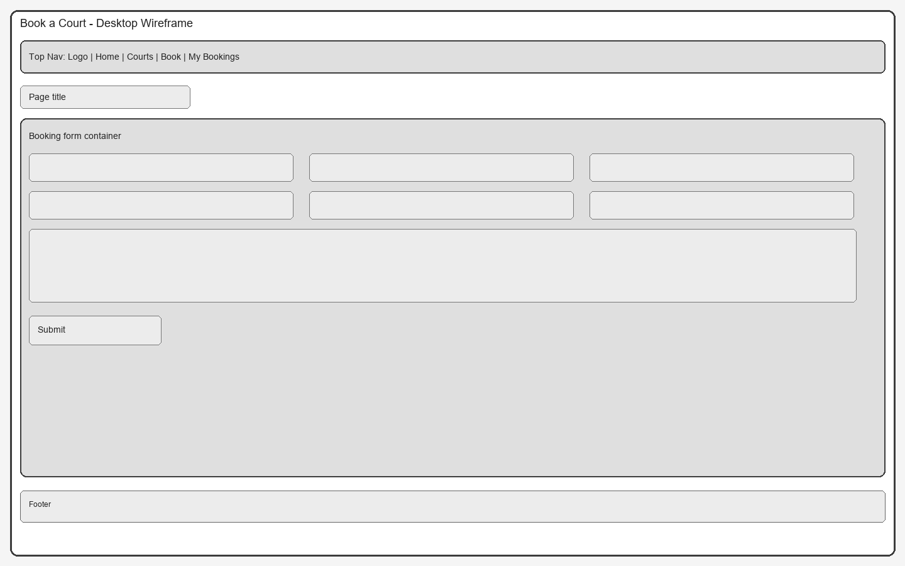
- Mobile:

  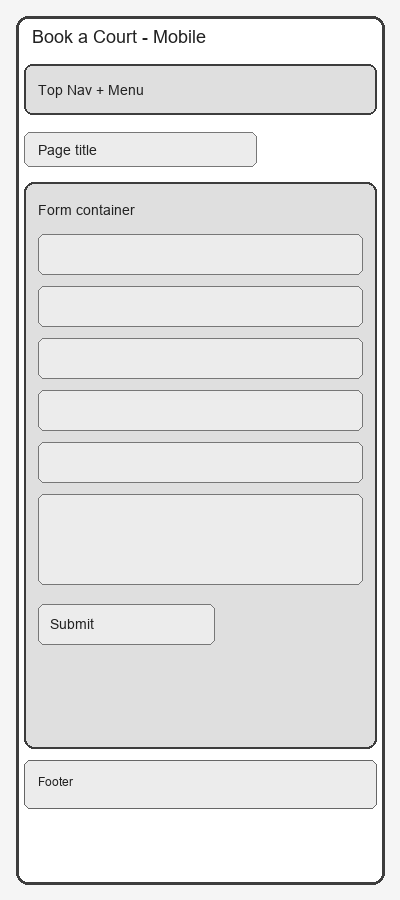

#### My Bookings Page

- Desktop:

  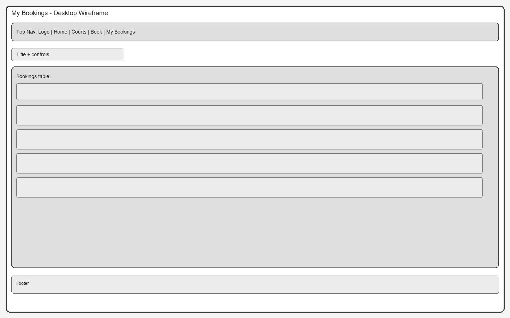
- Mobile:

  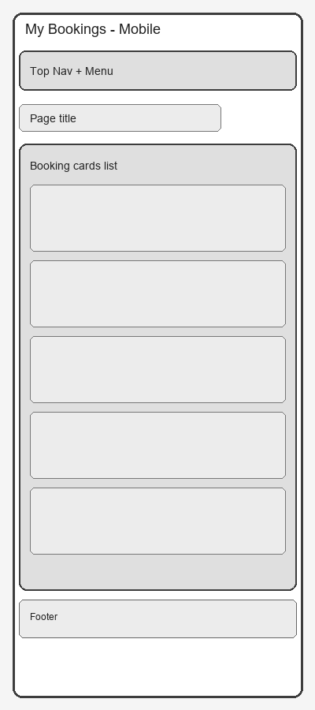

### Agile Methodology

The SetPoint project was developed using an Agile methodology, supported by a GitHub Kanban board to manage tasks, user stories, and overall development progress.

**The workflow was organised using the following columns:**

Backlog (This item hasn't been started)
Ready (This is ready to be picked up)
In Progress (This is actively being worked on)
In Review (This item is in review)
Done ( THis has been completed)
Future Features ( planned for future development)

User stories were prioritised using the MoSCoW method (Must Have, Should Have, Could Have) to ensure that essential booking functionality was implemented first while allowing room for additional improvements if time permitted.

**Development was structured into the following sprints:**

**Sprint 1** – Foundation
Project setup, Django configuration, base templates, navigation, and authentication with django-allauth. Core Court and Booking models were created and a basic availability view implemented. The project was deployed to Heroku early to identify potential deployment issues.

**Sprint 2** – MVP Booking Flow
Implementation of the core booking system. Users can book courts, view available time slots, receive confirmations, and manage their bookings. Validation prevents double bookings and ensures only the booking owner can cancel.

**Sprint 3** – Admin & Demo Preparation
Admin tools were added to manage bookings and court availability. An About page was implemented and made editable via admin, along with UI improvements for the demo.

**Sprint 4** – Testing & Enhancements
Final testing, bug fixing, and validation improvements were completed. Additional stretch features were explored where possible.

### Typography

This project uses Bootstrap’s default typography, which relies on a system sans-serif font stack (for example Segoe UI, Roboto, and Arial, depending on the user’s device). No custom font was added, to keep the design clean, fast-loading, and consistent across browsers.

### Colour Scheme

The colour palette for SetPoint was designed to reflect a clean, modern sports theme inspired by tennis courts and outdoor environments. Green tones represent the tennis court surface, while soft neutrals and glass effects create a light and accessible interface.

The application uses CSS variables defined in the `:root` selector to maintain a consistent design system across the interface:


| Colour Name       | Colour Code | Preview                                                   |
| ------------------- | ------------- | ----------------------------------------------------------- |
| Background        | `#eef2f2`   |  |
| Text (Ink)        | `#13231f`   |  |
| Accent Green      | `#2f9e44`   |  |
| Accent Dark Green | `#247a35`   |  |
| Surface (White)   | `#ffffff`   |  |
| Glow Highlight    | `#dfff75`   |  |

### Database Diagram

The database schema for SetPoint is shown below, including the main models and their relationships.


SetPoint uses a relational database structure centred around bookings:

- **Court** stores court details (number, surface type, availability, and maintenance windows).
- **Booking** stores reservation data (player details, date/time, court number, and payment status).
- **SavedSlot** lets authenticated users save preferred date/time/court combinations for quick rebooking.
- **ContactRequest** stores support/refund enquiries and can optionally link to a specific booking.
- **About** stores editable About page content managed through the admin panel.

  Relationships are mainly driven by Django `ForeignKey` fields: one user can have many bookings, saved slots, and contact requests; and one booking can have multiple related contact requests.

## Features:

Explain your features on the website (navigation, pages, links, forms, input fields, CRUD).

### Navigation

### Footer

### Home-page

### Add your pages

### CRUD

### Authentication-Authorisation

## Technologies Used

### Core Technologies

- **Python 3.12** – main backend programming language
- **Django 6.0.2** – web framework used to build the application
- **HTML5** – structure of the website
- **CSS3** – custom styling and layout
- **Bootstrap 5** – responsive design framework

### Django Libraries

- **django-allauth** – authentication system (signup, login, logout)
- **django-summernote** – rich text editor for admin content management

### Payment Integration

- **Stripe** – secure payment processing for bookings

### Database

- **PostgreSQL** – production database used with Heroku
- **psycopg2-binary** – PostgreSQL adapter for Python

### Deployment & Hosting

- **Heroku** – cloud platform used for deployment
- **Gunicorn** – WSGI HTTP server used in production
- **WhiteNoise** – static file serving for Django

### Additional Packages

- **dj-database-url** – database configuration via environment variables
- **Requests** – HTTP requests library

### Version Control

- **Git**
- **GitHub**

## Libraries Used

The following libraries and packages were used to support development, deployment, and functionality within the project:

- **Django** – Core web framework used to build the application.
- **django-allauth** – User authentication, registration, login, and logout.
- **django-summernote** – Rich text editor support for admin-managed content.
- **stripe** – Stripe API integration for secure booking payments.
- **dj-database-url** – Database configuration via environment variables.
- **psycopg2-binary** – PostgreSQL database adapter for Python.
- **gunicorn** – Production WSGI server for Heroku deployment.
- **whitenoise** – Static file serving in production.
- **requests** – HTTP client library for external requests.
- **bleach** – HTML sanitisation support (used with rich text content).
- **asgiref**, **sqlparse**, **tzdata**, **typing_extensions**, **packaging**, **certifi**, **charset-normalizer**, **idna**, **urllib3**, **webencodings** – Supporting dependencies required by the primary libraries.

## Testing

### Google's Lighthouse Performance

### Mobile

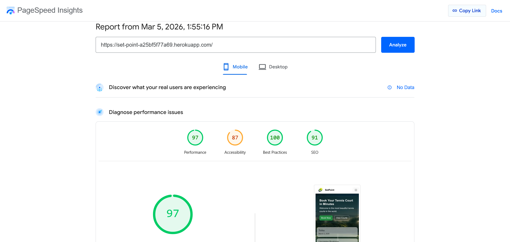

### Desktop

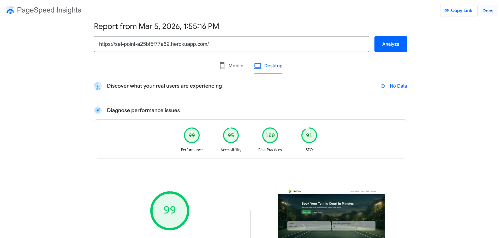

### Browser Compatibility

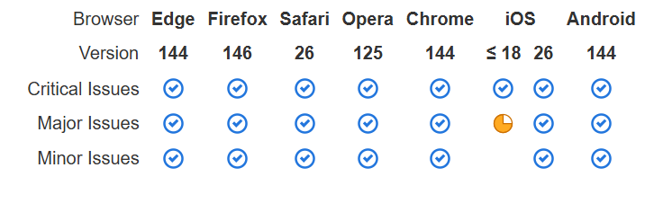

PowerMapper flagged limited support for the CSS backdrop-filter property in older browsers; however, background-color fallbacks are implemented so the interface remains fully usable without blur effects.

### Responsiveness


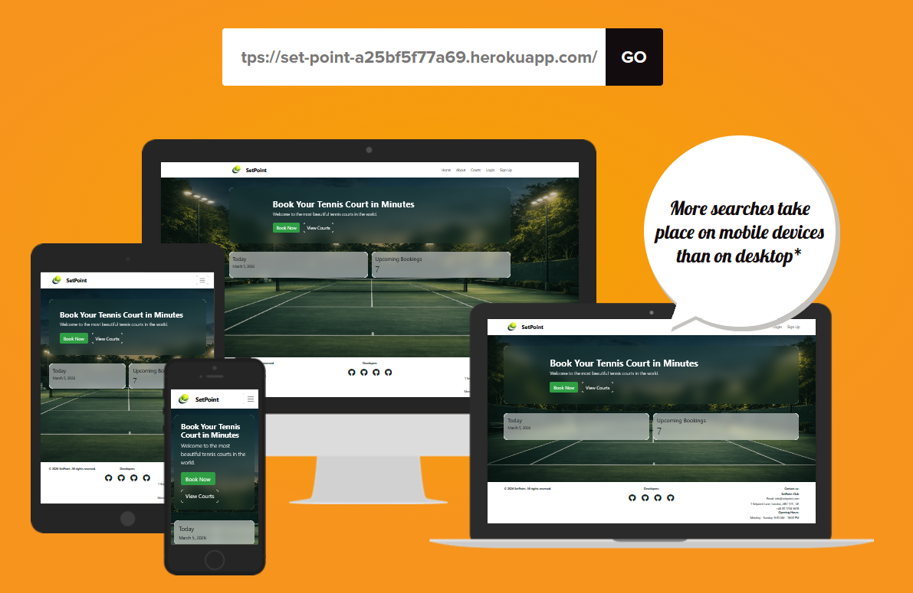

### Code Validation

#### HTML Validation

All pages were validated as a guest and logged-in user using the [W3C HTML Validator](https://validator.w3.org/).


| Page                                  | Result    |
| --------------------------------------- | ----------- |
| Home (`/`)                            | No errors |
| Courts (`/courts/`)                   | No errors |
| Book Court (`/book/<id>/`)            | No errors |
| My Bookings (`/my-bookings/`)         | No errors |
| About (`/about/`)                     | No errors |
| Contact Support (`/contact-support/`) | No errors |
| Login (`/accounts/login/`)            | No errors |
| Signup (`/accounts/signup/`)          | No errors |

Screenshot of validation results:


#### PEP8 / Python Linting

Python code style was checked with a linter and the output is shown below:


The report highlights a small number of style warnings (for example line length, spacing, and docstring formatting) rather than functional errors. These are non-blocking issues, and the application still runs and passes the automated test suite.


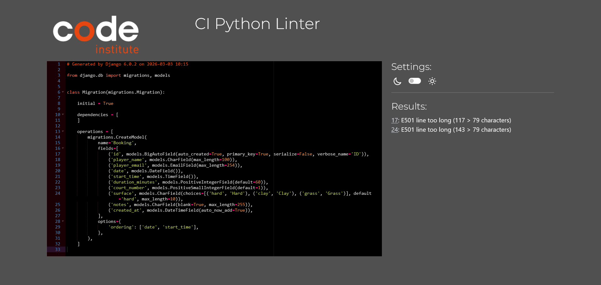

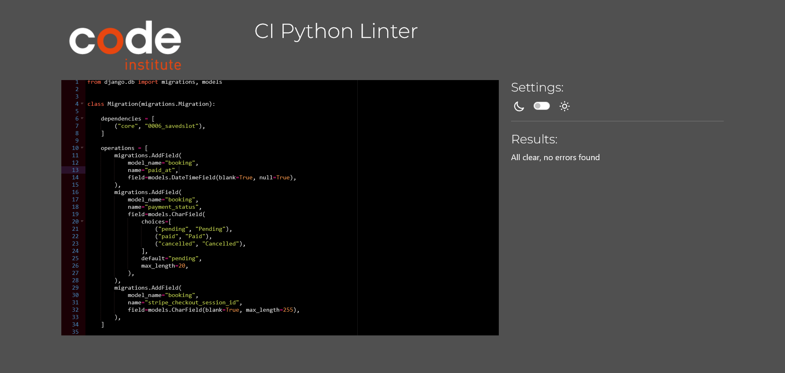

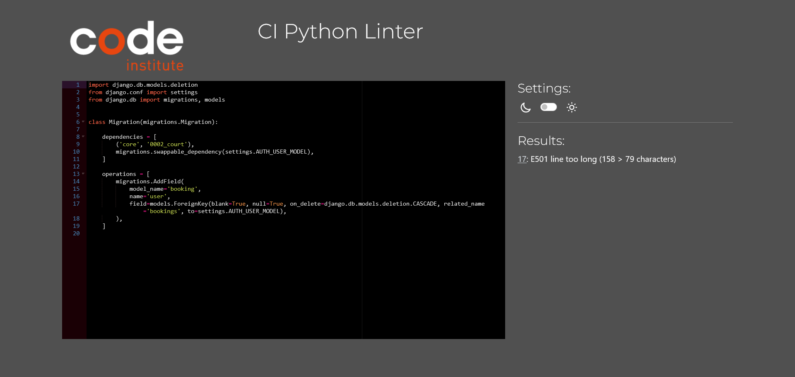

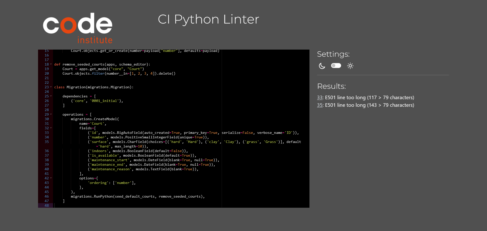

### Feature Manual Testing


| Feature                          | How to Test                                                                        | Expected Result                                                                 | Result |
| ---------------------------------- | ------------------------------------------------------------------------------------ | --------------------------------------------------------------------------------- | :------: |
| User Registration                | Navigate to Sign Up, enter email, username, and password, then submit.             | Account is created and user can log in.                                         |  Pass  |
| User Login/Logout                | Log in with valid credentials; verify access to My Bookings; then log out.         | User session is authenticated when logged in; redirected after logout.          |  Pass  |
| Court Listing & Filtering        | Open Courts page; filter by surface type and/or date.                              | Courts display with correct surface filters applied; unavailable courts hidden. |  Pass  |
| View Court Availability          | Open Courts or Book Court page and check available time slots.                     | Available slots are shown; booked/unavailable slots are not selectable.         |  Pass  |
| Create Booking                   | Select a court, date, and time, then submit the booking form.                      | Booking is created and appears in My Bookings with Pending payment status.      |  Pass  |
| Edit Own Booking                 | From My Bookings, click Edit on own booking and change date/time.                  | Changes are saved; no overbooking or conflict occurs.                           |  Pass  |
| Cancel Own Booking               | From My Bookings, click Cancel on own booking.                                     | Booking is removed and success message appears.                                 |  Pass  |
| Prevent Editing Others' Bookings | Try accessing edit URL for another user's booking directly.                        | Access is denied (403) or user is redirected.                                   |  Pass  |
| Initiate Payment                 | From My Bookings, click Pay now on a pending booking.                              | User is redirected to Stripe Checkout session.                                  |  Pass  |
| Peak/Off-Peak Pricing            | Create bookings at different times (e.g., 09:00 vs 17:00) and check price display. | Peak times (17:00–20:00) show higher price than off-peak times.                |  Pass  |
| Save Slot                        | Use Save court/date/time button from Book Court page.                              | Slot appears in Saved/Bookmarked Slots section in My Bookings.                  |  Pass  |
| Rebook from Saved Slot           | Click Rebook link on a saved slot in My Bookings.                                  | Book Court form pre-fills with saved court/date/time.                           |  Pass  |
| View Past Bookings               | Navigate to My Bookings with historical bookings present.                          | Past bookings are shown separately from upcoming bookings.                      |  Pass  |
| Contact Support                  | Fill out the contact form with a message and optional booking reference.           | Contact request is saved and success message appears.                           |  Pass  |
| View About Page                  | Click About in the navigation menu.                                                | About page loads with editable content from admin.                              |  Pass  |
| Responsive Design                | Test key pages on mobile (320px) and desktop (1200px+).                            | Layout adapts; no overlapping text or broken elements.                          |  Pass  |

#### Feature Manual Test Screenshots


| Feature Area                              | Screenshot Evidence                                                                                                                                      |
| ------------------------------------------- | ---------------------------------------------------------------------------------------------------------------------------------------------------------- |
| Authentication (signup/login/logout)      | `core\static\core\images\testing-images\feature-sign-in.png`                                                                                             |
| Court discovery and filtering             | `core\static\core\images\testing-images\feature-court-filtering.png`                                                                                     |
| Booking creation and edit                 | `core\static\core\images\testing-images\feature-court-booking-form.png`                                                                                  |
| Stripe payment success/cancel             | `core\static\core\images\testing-images\feature-stripe.png` `core\static\core\images\testing-images\feature-stripe-confirm.png`                          |
| Booking cancellation and history          | `core\static\core\images\testing-images\feature-past-upcoming-bookings.png`                                                                              |
| Saved slots and quick rebook              | `core\static\core\images\testing-images\feature-saved-slot.png`                                                                                          |
| Contact support and About page            | Contact Support:`core\static\core\images\testing-images\feature-contact.png` About page: `core\static\core\images\testing-images\feature-about-page.png` |
| Admin booking/availability/refund actions | `core\static\core\images\testing-images\admin-test-change-booking.png` `core\static\core\images\testing-images\admin-test-court.png`                     |

### Automated Testing Against User Stories

Automated test results from `core/tests.py` using:
`c:/Users/hanna/Desktop/final-hackathon/Hackathon-Project-2/.venv/Scripts/python.exe manage.py test core.tests -v 2`

Overall result: `31` tests run, `31` passed


| Test Area (tests.py class) | What it validates                                                                                              |     Result     |
| ---------------------------- | ---------------------------------------------------------------------------------------------------------------- | :---------------: |
| `AvailabilityBookingTests` | Court availability filtering, maintenance/unavailable booking protection, and booking page fallback messaging. |  Pass (`8/8`)  |
| `BookingAdminTests`        | Booking admin registration, config, and admin/non-admin access control.                                        | Partial (`4/4`) |
| `BookingConfirmationTests` | Booking confirmation message behavior and duplicate slot prevention.                                           | Partial (`3/3`) |
| `CancelBookingTests`       | Ownership checks and cancellation permissions (including forbidden/manual URL cases).                          |  Pass (`4/4`)  |
| `CourtAdminTests`          | Court admin registration and admin list configuration.                                                         |  Pass (`2/2`)  |
| `PricingDisplayTests`      | Peak/off-peak pricing helpers and UI price display in courts/payment/my bookings pages.                        |  Pass (`5/5`)  |
| `SavedSlotTests`           | Save/unsave slot behavior, duplicate prevention, and rebook links from saved slots.                            |  Pass (`5/5`)  |

## Bugs

List bugs and how you fixed them.

## Deployment

This project is deployed on Heroku from the GitHub repository.

### 1. Prepare the project

Make sure the following files are present in the root of the project:

- `requirements.txt`
- `Procfile` (web process for Gunicorn)
- `runtime.txt` (Python version)

Generate or update dependencies before deploying:

```bash
pip freeze > requirements.txt
```

### 2. Create the GitHub repository

- Sign in to [GitHub](https://github.com/).
- Create a new repository (or use the Code Institute template if required).
- Push your project code to the `main` branch.

### 3. Create a Heroku app

- Sign in to [Heroku](https://www.heroku.com/).
- Click **New** → **Create new app**.
- Enter a unique app name and select your region.
- Click **Create app**.

### 4. Provision a database

- Create a PostgreSQL database (for example via [CI Database Maker](https://dbs.ci-dbs.net/) or Heroku Postgres).
- Copy the database URL.

### 5. Configure environment variables

In Heroku, open **Settings** → **Config Vars** and add:

- `DATABASE_URL`
- `SECRET_KEY`
- `STRIPE_PUBLIC_KEY`
- `STRIPE_SECRET_KEY`
- `STRIPE_WEBHOOK_SECRET` (if using webhooks)
- `CLOUDINARY_URL` (if media storage is configured)
- `DISABLE_COLLECTSTATIC` (optional, only for troubleshooting static collection)

### 6. Connect Heroku to GitHub and deploy

- Open the **Deploy** tab in Heroku.
- In **Deployment method**, select **GitHub**.
- Connect your repository.
- Choose either:
  - **Automatic Deploys** from `main`, or
  - **Manual Deploy** → **Deploy Branch**.

### 7. Post-deployment checks

After deployment:

- Open the app URL and verify pages load correctly.
- Run migrations from Heroku if needed:

```bash
heroku run python manage.py migrate -a <your-app-name>
```

- Optionally create a superuser:

```bash
heroku run python manage.py createsuperuser -a <your-app-name>
```

### 8. Local environment setup (for development)

Use an `env.py` file locally (not committed to Git) for sensitive keys, and ensure the same variables are set in Heroku Config Vars for production.

### Project Structure

```text
booking_app/                  # Django project config
core/
  forms.py                    # Booking form
  models.py                   # Booking model
  urls.py                     # App routes
  views.py                    # View functions
  templates/core/             # HTML templates
  static/core/styles.css      # Shared CSS
wireframes/                   # SVG and PNG wireframes
docs/
  kanban_user_story_template.md
```

### Setup and Run

```powershell
.\.venv\booking_app\Scripts\python.exe manage.py migrate
.\.venv\booking_app\Scripts\python.exe runserver
```

Open: `http://127.0.0.1:8000/`

## AI

AI tools were used throughout the project as a support assistant during development and documentation.

Key areas where AI was used:

- **User story ideation**: to brainstorm and refine user stories before adding them to the project board.
- **Bug fixing support**: to help diagnose errors, suggest likely causes, and propose fix approaches.
- **README enhancements**: to improve wording, structure, and clarity across documentation sections.
- **General development support**: to review implementation ideas and speed up routine writing tasks.

All AI-generated suggestions were reviewed, edited, and validated by the development team before being applied.

## Credits

### Acknowledgments

- Django documentation
- Django Allauth documentation
- Bootstrap documentation
- jsDelivr CDN (Bootstrap CSS/JS delivery)
- Font Awesome (social and UI icons)
- Stripe and Stripe documentation (payment integration)
- Heroku (deployment platform)
- CI Database Maker (PostgreSQL provisioning)
- Lucidchart (database diagrams)
- Edraw for linux (wireframes)
- GitHub Copilot (development assistance)
- ChatGPT (ideation, debugging support, and documentation wording)
- Tinyfy (image optimisation/compression)
- PowerMapper (check browser compatibility testing)
- Discord (team communication)
- Team contributors and reviewers
